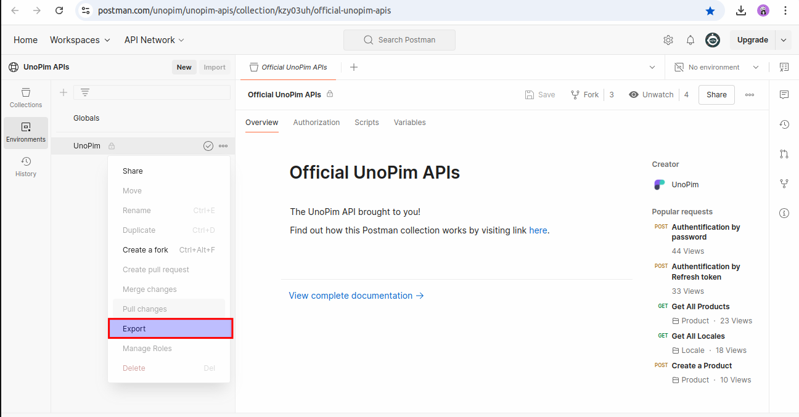

# Configuration

[[toc]]

# Creating API Credentials

UnoPim allows you to generate API credentials that control access to the platform through integrations. The process includes setting up API keys, configuring permissions, assigning users, and generating secret keys.

## Steps to Create API Credentials

1. **Navigate to the Integrations Tab**:
   - Go to **Configuration** -> **Integrations** in the UnoPim admin panel.

  

2. **Click on Create**:
   - Under the API Keys section, click the **Create** button to start the process of creating a new API key.

3. **General Section**:
   - In the **General** Section, provide the following details:
     - **Name**: Enter a unique name for the API key.
     - **Assign User**: Choose the user who will be assigned to this API key.

    

4. **Access Control**:
   - Navigate to the **Access Control** Section, where you'll configure permissions for the API key.

   - **Permissions Field**: You’ll see two options for setting permissions:
     1. **All**: Grants full access to the API key across all features.
     2. **Custom**: Allows you to define specific permissions.
     
     If you select **Custom**, the following options will appear:
     - **Settings Permissions**: Use checkboxes to select which settings the API key can access.
     - **Catalog Permissions**: Similarly, choose catalog-related permissions using checkboxes.

5. **Save and Activate**:
   - After filling out the necessary details and selecting permissions, click **Save** to generate the API credentials.

   

6. **Generate Secret Key**:
   - Once saved, a **Generate Secret Key** button will appear.
   - Click on this button to display the **Client ID** and **Secret Key**.
   - These credentials will be used to access UnoPim's APIs.

   
   

**Note** : 
**Re-Generate Secret Key**:
   - After generating the secret key, a **Re-Generate Secret Key** button will be available.
   - Use this button to regenerate the secret key if needed.

**Create API Credentials User Guide**

For more detailed reference, you can consult the UnoPim **User Guide** [here](https://docs.unopim.com/1.0/configuration/integration.html).

---

## Set up Postman

UnoPim provides a Postman collection and environment to simplify API testing and exploration.

#### Step by step

1. **Download Postman**:
   - If you haven’t already, download and install the **Postman** application from the [official website](https://www.postman.com/downloads/).

2. **Download the required files**:
   - Download the following files to your system:
     - [The Postman collection](https://www.postman.com/unopim/unopim-apis/collection/kzy03uh/official-unopim-apis)

     - [Download collection file](../../postman_collection.json)

    

     - [A pre-configured Postman environment](https://www.postman.com/unopim/unopim-apis/environment/37137259-33153010-2118-486f-bafe-2ed0b75ad39d)

     - [Download environment file](../../postman_environment.json)

    

3. **Import into Postman**:
   - Open Postman and use the **Import** button to add both the collection and environment files.
   
4. **Select Environment**:
   - Once the environment is imported, select the **UnoPim API** environment from the environment dropdown menu.
   - Set the **Environment** variables, including the **username**, **password**, **clientId**, **secret**, and the **URL** of the application.

   

5. **Send a Request**:
   - Now you can send your first request using the pre-configured Postman collection to interact with UnoPim APIs.